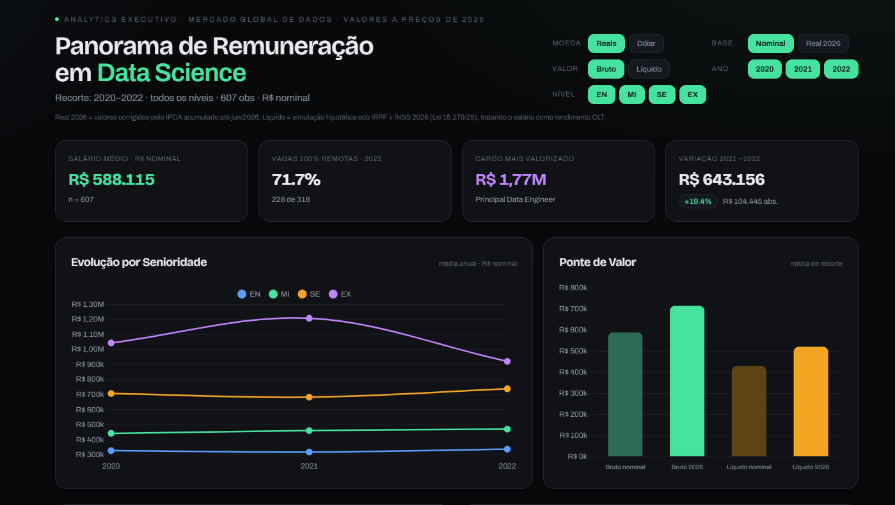

# 📊 Panorama de Remuneração em Data Science (2020–2026)

## 🌐 Dashboard Online

https://callout84.github.io/data-science-salary-analytics-dashboard/

---

## 📌 Sobre o Projeto

Este projeto apresenta uma análise executiva da evolução salarial do mercado global de Data Science entre 2020 e 2026.

O dashboard foi desenvolvido com foco em Business Intelligence, Analytics e Storytelling Executivo, transformando dados brutos em informações estratégicas para profissionais que desejam compreender tendências de remuneração, impacto da inflação, tributação e mudanças no mercado de trabalho.

O objetivo não foi apenas visualizar salários, mas responder perguntas relevantes para profissionais e gestores:

- Como os salários evoluíram ao longo dos anos?
- Qual o impacto da inflação nos valores históricos?
- Quanto sobra após impostos no Brasil?
- O trabalho remoto influencia a remuneração?
- Quais cargos apresentam maior valorização?
- Existe diferença entre empresas pequenas, médias e grandes?
- Como diferentes níveis de senioridade evoluíram?

---

## 🎯 Objetivos Analíticos

Este projeto foi construído para simular uma análise executiva semelhante às utilizadas em áreas de:

- Business Intelligence
- People Analytics
- Workforce Analytics
- Compensation & Benefits
- Talent Acquisition
- Planejamento Estratégico

---

## 📈 Principais Análises

### Evolução Salarial por Senioridade

Comparação da progressão salarial entre:

- Entry Level
- Mid Level
- Senior Level
- Executive Level

---

### Impacto da Inflação

Todos os salários foram ajustados para valores equivalentes de 2026, permitindo análises comparáveis ao longo do tempo.

---

### Salário Bruto vs Salário Líquido

Simulação de descontos considerando:

- INSS
- IRPF
- Regras tributárias brasileiras vigentes

---

### Mercado Remoto

Avaliação da transformação do mercado para modelos:

- Presencial
- Híbrido
- 100% Remoto

---

### Ranking de Cargos

Comparação entre funções como:

- Data Analyst
- Data Scientist
- Machine Learning Engineer
- Data Engineer
- Research Scientist
- Analytics Manager
- Head of Data

---

### Análise Geográfica

Identificação dos mercados com maior remuneração média considerando a localização das empresas.

---

## 🛠️ Tecnologias Utilizadas

### Front-End

- HTML5
- Tailwind CSS
- JavaScript
- Chart.js

### Analytics

- Modelagem de dados
- Limpeza de dados
- Transformação de métricas
- Storytelling Executivo

### Ferramentas

- GitHub
- GitHub Pages
- Claude AI
- ChatGPT

---

## 🤖 Uso de Inteligência Artificial

Durante o desenvolvimento deste projeto utilizei ferramentas de Inteligência Artificial como Claude e ChatGPT para acelerar pesquisas, explorar abordagens analíticas e compreender melhores práticas de desenvolvimento.

Todo o processo foi estudado, validado e ajustado manualmente.

Meu objetivo ao utilizar IA não é substituir o aprendizado, mas potencializar a capacidade de análise, desenvolvimento e resolução de problemas, alinhando-me às tecnologias que já fazem parte do mercado de dados.

---

## 📚 Jornada de Aprendizado

Atualmente estou em transição para a área de Dados, estudando:

- Python
- SQL
- Power BI
- Data Analytics
- Data Science
- Business Intelligence
- Visualização de Dados

Cada projeto publicado representa uma etapa prática dessa jornada de aprendizado.

---

## 🚀 Próximos Passos

Planejo evoluir este projeto com:

- Integração de datasets atualizados
- Pipeline automatizado em Python
- Banco de dados SQL
- Dashboards em Power BI
- Modelos preditivos
- Deploy em cloud
- APIs de mercado

---

## 📬 Contato

LinkedIn:
www.linkedin.com/in/hewerson-francelino

GitHub:
https://github.com/Callout84

---

## ⭐ Considerações Finais

Este projeto faz parte da construção do meu portfólio profissional em Data Science e Analytics.

Busco desenvolver projetos que combinem análise de dados, visualização, indicadores de negócio e tomada de decisão baseada em dados, aproximando o aprendizado acadêmico das demandas reais do mercado.
